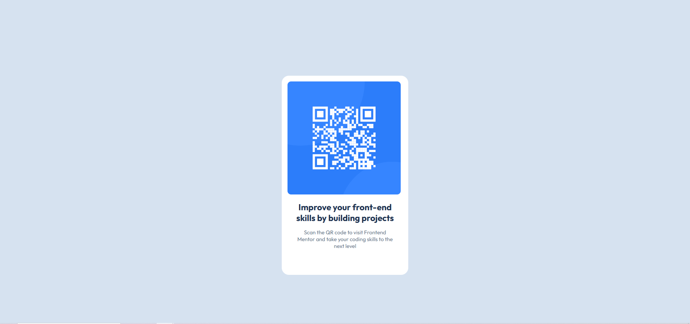

# Frontend Mentor - QR code component solution

This is a solution to the [QR code component challenge on Frontend Mentor](https://www.frontendmentor.io/challenges/qr-code-component-iux_sIO_H). Frontend Mentor challenges help you improve your coding skills by building realistic projects. 

## Table of contents

- [Frontend Mentor - QR code component solution](#frontend-mentor---qr-code-component-solution)
  - [Table of contents](#table-of-contents)
  - [Overview](#overview)
    - [Screenshot](#screenshot)
      - [Desktop version](#desktop-version)
      - [Mobile version](#mobile-version)
  - [My process](#my-process)
    - [Built with](#built-with)
    - [What I learned](#what-i-learned)
    - [Continued development](#continued-development)
  - [Author](#author)

**Note: Delete this note and update the table of contents based on what sections you keep.**

## Overview

### Screenshot

#### Desktop version



#### Mobile version


## My process

### Built with

- Semantic HTML5 markup
- CSS custom properties
- Flexbox
- Mobile-first workflow
- Just with your knowledge

### What I learned

This project allowed me to review HTML semantics, as well as flexbox.

```css
div {
    display: flex;
    flex-direction: column;
    gap: 16px;
    padding: 16px;
}
```

### Continued development

I would like to do projects to improve my understanding and especially the use of JavaScript.

## Author

- GitHub - [ThibaultVLT](https://github.com/ThibaultVlt)
- Linkedin - [Thibault](https://www.linkedin.com/in/thibaultvollet/)
